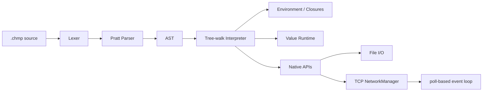

<div align="center">

# Chompo

### Динамический язык и tree-walk интерпретатор на C++23

[](https://en.cppreference.com/w/cpp/23)
[](https://cmake.org/)
[](https://github.com/Bony-Lord/ChompoC/actions/workflows/ci.yml)
[](LICENSE)


**Chompo** — динамически типизированный язык с файлами `.chmp`, функциями первого класса, замыканиями, изменяемыми массивами и строками, файловым I/O и TCP API.

[Возможности](#-возможности) · [Запуск](#-быстрый-старт) · [I/O](#-ввод-и-вывод) · [Network API](#-network-api) · [LangJam](#-готовность-к-langjam) · [Roadmap](#-roadmap)

</div>

> [!IMPORTANT]
> Рабочая ветка проекта — `dev`. До сдачи LangJam приоритет имеют работающий чат, документация запуска и демонстрационный сценарий. Собственная VM и AtomVM не требуются.

## ✨ Возможности

| Подсистема | Статус | Возможности |
|---|:---:|---|
| Значения | ✅ | `NULL`, `bool`, `integer`, `double`, `char`, `string`, `array`, `callable` |
| Переменные | ✅ | `var`, вложенные scope, обычные и составные присваивания |
| Управление | ✅ | `if`, `else`, `while`, `for-in`, `break`, `continue` |
| Функции | ✅ | параметры, `return`, рекурсия, first-class functions, closures |
| Коллекции | ✅ | массивы, индексация, мутация, `len`, `in`, повторение и конкатенация |
| Строки | ✅ | байтовые `char`, индексация и мутация |
| I/O | ✅ | `input`, `istream`, `ostream`, `iostream` |
| TCP | ✅ | listener, client socket, poll, accept, send, receive, close |
| Надёжность | ✅ | Runtime StackOverflow, запрет циклических массивов, CTest, GitHub Actions |
| LangJam chat | 🚧 | сервер и клиент на Chompo ещё нужно написать |

## 🚀 Быстрый старт

Требуется компилятор с C++23 и CMake 4.2+.

```bash
cmake -S . -B build
cmake --build build --parallel
ctest --test-dir build --output-on-failure
```

Запуск:

```bash
./build/Chompo program.chmp
```

Windows с multi-config генератором:

```powershell
.\build\Debug\Chompo.exe program.chmp
```

## ⚡ Пример

```javascript
fun sum(values) {
    var result = 0;

    for (var value in values)
        result += value;

    return result;
}

var values = Array{10, 20, 30};
print(sum(values), "\n");
```

## 🧩 Основной синтаксис

```javascript
var value = 10;
value += 5;

if (value > 10) {
    print("large\n");
}

while (value > 0)
    value--;

for (var character in "Chompo") {
    if (character == 'm')
        continue;

    print(character);
}
```

Встроенные преобразования: `Int`, `Double`, `Bool`, `String`, `Char`, `Array`, `CATS`, `Type`.

## 📥 Ввод и вывод

`input()` читает одну строку из текущего входного потока без `\n`. На EOF возвращается `NULL`.

```javascript
var line = input();
```

Стандартный поток обозначается строкой `"standart"` — написание сохранено как часть текущего API.

```javascript
istream("input.txt");
istream("standart");

ostream("output.txt", "rewrite");
ostream("output.txt", "append");
ostream("new.txt", "create");
ostream("standart");

iostream("input.txt", "output.txt", "rewrite");
iostream();
```

Режимы выходного файла:

| Режим | Поведение |
|---|---|
| `"rewrite"` | создать файл или полностью перезаписать существующий; значение по умолчанию |
| `"append"` | дописывать в конец |
| `"create"` | создать новый файл и завершиться ошибкой, если он уже существует |

## 🌐 Network API

Сетевой API использует TCP-сокеты хоста. Собственная VM для него не нужна.

| Функция | Результат |
|---|---|
| `netListen(host, port, backlog?)` | handle listener-а |
| `netConnect(host, port)` | handle client socket-а |
| `netAccept(listener)` | socket handle или `NULL`, если подключений пока нет |
| `netPoll(handles, timeoutMs?)` | массив готовых handles |
| `netSend(socket, data)` | количество отправленных байт |
| `netReceive(socket, maxBytes?)` | `Array{"data", text}`, `Array{"wait"}` или `Array{"closed"}` |
| `netReceiveLine(socket)` | такая же структура, но чтение до `\n` |
| `netPort(handle)` | локальный TCP-порт; удобно для тестов с портом `0` |
| `netClose(handle)` | закрывает listener или socket |

Минимальный echo-сервер:

```javascript
var listener = netListen("0.0.0.0", 4040);
var clients = Array{};

while (true) {
    var watched = Array{listener} + clients;
    var ready = netPoll(watched, 100);

    for (var handle in ready) {
        if (handle == listener) {
            var client = netAccept(listener);
            if (client != NULL)
                clients += Array{client};
            continue;
        }

        var packet = netReceiveLine(handle);

        if (packet[0] == "data")
            netSend(handle, packet[1] + "\n");
    }
}
```

> [!NOTE]
> API синхронный, но сокеты неблокирующие. `netPoll` позволяет построить однопоточный event loop и обслуживать нескольких пользователей одним интерпретатором.

## 🏗 Архитектура



Tree-walk интерпретатор уже удовлетворяет требованию «компилятор или интерпретатор». Bytecode VM может быть полезна позже для скорости, но не является частью обязательной сдачи.

## 🧪 Тестирование

```bash
ctest --test-dir build --output-on-failure
```

Набор включает golden tests языка, error regression suite, файловый I/O и TCP loopback-тест. GitHub Actions запускает сборку и тесты на Windows и Ubuntu при `push` и `pull_request`.

## 🏁 Готовность к LangJam

По правилам `langdev-jam/plic` требуется язык и многопользовательская чат-комната. AtomVM указана как приоритет, но альтернативные платформы разрешены; Chompo уже является интерпретатором на C++.

### Уже выполнено

- [x] собственный синтаксис и семантика;
- [x] интерпретатор на выбранной платформе;
- [x] переменные и динамические типы;
- [x] условия;
- [x] циклы и рекурсия;
- [x] функции и closures;
- [x] массивы и строки;
- [x] пользовательский и файловый I/O;
- [x] TCP listener/client API;
- [x] неблокирующий `netPoll` для нескольких клиентов;
- [x] автоматические тесты Windows/Linux.

### Обязательно осталось

- [ ] написать сервер чата на Chompo;
- [ ] написать клиент чата на Chompo;
- [ ] добавление пользователя и уникального имени;
- [ ] broadcast сообщений всем участникам;
- [ ] история последних `N` сообщений;
- [ ] корректный выход и удаление пользователя;
- [ ] короткая инструкция запуска сервера и клиентов;
- [ ] краткое описание синтаксиса в директории сдачи;
- [ ] добавить проект в fork `langdev-jam/plic` и открыть pull request.

### На баллы архитектуры и креативности

- [ ] команды `/help`, `/history`, `/quit`;
- [ ] timestamps;
- [ ] несколько комнат или приватные сообщения;
- [ ] сохранение истории через `ostream(..., "append")`;
- [ ] аккуратная обработка отключившихся клиентов.

> [!WARNING]
> Дедлайн в репозитории jam указан как **20 июля**. До него не стоит тратить время на VM, GC, LSP или полноценную async-модель.

## 🗺 Roadmap

### До LangJam

- [x] `while`, `for-in`, `break`, `continue`, `in`;
- [x] потоковый и файловый I/O;
- [x] строковые режимы `rewrite`, `append`, `create`;
- [x] TCP API и `netPoll`;
- [ ] законченный чат на Chompo;
- [ ] submission package и demo.

### После LangJam

- [ ] `Map`/словари;
- [ ] модули и `import`;
- [ ] exceptions языка;
- [ ] Unicode;
- [ ] garbage collector для циклических графов;
- [ ] bytecode compiler и VM только при реальной необходимости производительности;
- [ ] actors/channels и полноценный async runtime;
- [ ] REPL, formatter, LSP и редакторские плагины.

## 📄 Лицензия

MIT — см. [LICENSE](LICENSE).
