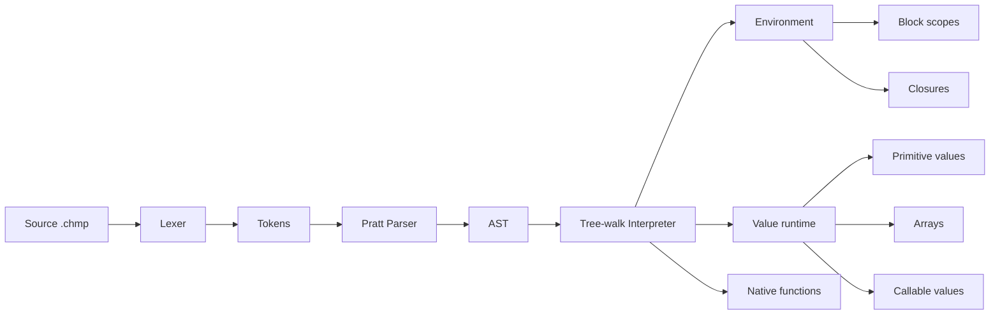

<div align="center">

# Chompo

### Динамический язык программирования и tree-walk интерпретатор на C++23

[](https://en.cppreference.com/w/cpp/23)
[](https://cmake.org/)
[](LICENSE)


**Chompo** — небольшой динамически типизированный язык с файлами `.chmp`, блочной областью видимости, функциями первого класса, замыканиями, изменяемыми массивами и строками.

[Возможности](#-возможности) · [Быстрый старт](#-быстрый-старт) · [Синтаксис](#-синтаксис) · [Архитектура](#-архитектура) · [Тесты](#-тестирование) · [Roadmap](#-roadmap)

</div>

> [!IMPORTANT]
> Chompo находится в активной разработке. Текущая ветка реализует основное ядро языка, но циклы, ввод-вывод и сетевой слой ещё находятся в roadmap.

---

## ✨ Возможности

| Подсистема | Состояние | Что поддерживается |
|---|:---:|---|
| Переменные | ✅ | `var`, присваивание, составное присваивание, блочная область видимости |
| Типы | ✅ | `NULL`, `bool`, `integer`, `double`, `char`, `string`, `array`, `callable` |
| Выражения | ✅ | арифметика, сравнения, логические операторы, группировка |
| Ветвления | ✅ | `if` / `else` |
| Функции | ✅ | параметры, `return`, рекурсия, функции первого класса |
| Замыкания | ✅ | функции сохраняют внешнее окружение |
| Массивы | ✅ | литералы, индексация, мутация, конкатенация, повторение |
| Строки | ✅ | индексация, мутация символов, конкатенация, повторение |
| Обновления | ✅ | prefix/postfix `++` и `--` для переменных и элементов |
| Встроенные функции | ✅ | преобразования типов, `len`, `CATS`, `Type` |
| Защита рантайма | ✅ | ограничение глубины вызовов и контролируемый `Runtime StackOverflow` |
| Автотесты | ✅ | CTest + golden output tests |
| Циклы | 🚧 | `while`, `for-in`, `break`, `continue` — следующий этап |
| Ввод-вывод | 📋 | планируется `IOStream` и `readLine(..., timeout?)` |
| Сеть | 📋 | планируется для чат-приложения LangJam |

---

## 🚀 Быстрый старт

### Требования

- компилятор с поддержкой **C++23**;
- **CMake 4.2+**;
- Ninja, Make или генератор вашей IDE.

### Сборка

```bash
cmake -S . -B build
cmake --build build
```

### Запуск программы

```bash
./build/Chompo path/to/program.chmp
```

Windows:

```powershell
.\build\Debug\Chompo.exe path\to\program.chmp
```

> [!TIP]
> При запуске без аргументов интерпретатор ищет демонстрационный файл `tests/cases/test_code.chmp`.

---

## ⚡ Пример программы

```javascript
fun make_counter(start) {
    var value = start;

    fun next() {
        return ++value;
    }

    return next;
}

var counter = make_counter(10);

print(counter(), "\n"); // 11
print(counter(), "\n"); // 12

var values = Array{10, 20, 30};
values[0]++;
values[1] += 5;

var text = "abc";
text[0]++;
text[1] = 'X';

print(values, "\n"); // {11, 25, 30}
print(text, "\n");   // bXc
print(len(values), " ", len(text), "\n");
```

---

## 🧩 Синтаксис

<details open>
<summary><strong>Переменные и области видимости</strong></summary>

```javascript
var value = 10;
value += 5;

{
    var local = "inside";
    print(local, "\n");
}
```

Неинициализированная переменная получает `NULL`:

```javascript
var result;
print(result); // NULL
```

</details>

<details>
<summary><strong>Типы и преобразования</strong></summary>

```javascript
print(Int("42"));
print(Double("2.5"));
print(Bool(0));
print(String(Array{1, 2}));
print(Char(65));
print(Type('A'));
```

Доступные встроенные преобразования:

| Функция | Назначение |
|---|---|
| `Int(value)` | преобразование в `integer` |
| `Double(value)` | преобразование в `double` |
| `Bool(value)` | преобразование по правилам truthiness |
| `String(value)` | строковое представление значения |
| `Char(value)` | байтовый символ из строки длины 1 или числа `0..255` |
| `Array(value)` | массив из значения; строка превращается в массив `char` |
| `CATS(array)` | `Char Array To String` — массив `char` в строку |
| `Type(value)` | имя типа значения |

`Char` участвует в числовых операциях через неявное преобразование к целому числу.

</details>

<details>
<summary><strong>Массивы</strong></summary>

```javascript
var numbers = Array{1, 2, 3};
var wrapped = Array(42);       // {42}
var chars = Array("abc");     // {a, b, c}

print(numbers[0]);
numbers[1] = 10;
numbers[2]++;

print(numbers + Array{4, 5});
print(numbers * 2);
print(len(numbers));
```

> [!NOTE]
> Массивы имеют ссылочную семантику. После `var second = first;` обе переменные указывают на один объект массива.

```javascript
var first = Array{1, 2};
var second = first;

second[0] = 100;
print(first); // {100, 2}
```

Циклические ссылки между массивами сейчас запрещены рантаймом, чтобы не допускать рекурсивного падения и циклов владения `shared_ptr`.

</details>

<details>
<summary><strong>Строки и символы</strong></summary>

```javascript
var text = "hello";

print(text[1]); // e
text[0] = 'H';
text[1]++;

print(text);        // Hfllo
print("ab" * 3);   // ababab
print(len(text));   // 5
```

Строки и `char` пока работают с байтами. Полноценная Unicode-модель запланирована после LangJam.

</details>

<details>
<summary><strong>Функции, рекурсия и замыкания</strong></summary>

```javascript
fun factorial(n) {
    if (n <= 1)
        return 1;

    return n * factorial(n - 1);
}

var operation = factorial;
print(operation(6)); // 720
```

Глубина вызовов ограничена параметром `MaxCallDepth`, поэтому бесконечная рекурсия завершается контролируемой runtime-ошибкой, а не падением системного стека.

</details>

<details>
<summary><strong>Операторы</strong></summary>

| Группа | Операторы |
|---|---|
| Арифметические | `+`, `-`, `*`, `/`, `%` |
| Сравнения | `==`, `!=`, `<`, `<=`, `>`, `>=` |
| Логические | `&&`, `||`, `!` |
| Присваивание | `=`, `+=`, `-=`, `*=`, `/=`, `%=` |
| Обновление | `++value`, `value++`, `--value`, `value--` |
| Индексация | `value[index]` |
| Вызов | `function(arguments...)` |

</details>

---

## 🏗 Архитектура



### Основные компоненты

```text
ChompoC/
├── CMakeLists.txt
├── README.md
├── LICENSE
├── src/
│   ├── main.cpp
│   ├── config.h
│   ├── lexer/
│   │   ├── lexer.h
│   │   ├── lexer.cpp
│   │   ├── token.h
│   │   └── token.cpp
│   ├── parser/
│   │   ├── ast.h
│   │   ├── parser.h
│   │   ├── parser.cpp
│   │   ├── ast_printer.h
│   │   └── ast_printer.cpp
│   └── interpreter/
│       ├── value.h
│       ├── value.cpp
│       ├── environment.h
│       ├── environment.cpp
│       ├── callable.h
│       ├── callable.cpp
│       ├── interpreter.h
│       ├── interpreter.cpp
│       ├── runtime_error.h
│       ├── runtime_error.cpp
│       └── return_signal.h
└── tests/
    ├── cases/
    ├── expected/
    └── run_case.cmake
```

### Технические решения

- AST хранится через `std::variant` и `std::unique_ptr`.
- Парсер выражений построен по Pratt-модели с таблицей приоритетов.
- Окружения связаны через `std::shared_ptr`, что обеспечивает вложенные области и замыкания.
- Массивы представлены как `std::shared_ptr<std::vector<Value>>`.
- Функции языка и native-функции реализуют общий интерфейс `Callable`.
- Native-функции поддерживают точную arity и диапазоны количества аргументов.
- Prefix/postfix обновления и составные присваивания работают через общий механизм изменяемых целей.

---

## ⚙️ Конфигурация рантайма

Compile-time настройки находятся в `src/config.h`:

```cpp
namespace ChompoConfig {
    inline constexpr bool EnableDebugOutput = false;
    inline constexpr bool EnableRuntimeWarnings = true;
    inline constexpr std::size_t MaxCallDepth = 512;
}
```

| Параметр | Назначение |
|---|---|
| `EnableDebugOutput` | вывод токенов и AST при запуске |
| `EnableRuntimeWarnings` | разрешение runtime-предупреждений |
| `MaxCallDepth` | максимальная глубина вызовов функций Chompo |

---

## 🧪 Тестирование

Проект использует **CTest** и golden tests: интерпретатор запускает `.chmp`-файл, после чего stdout или stderr сравнивается с ожидаемым результатом.

```bash
cmake -S . -B build
cmake --build build
ctest --test-dir build --output-on-failure
```

Текущий набор покрывает:

- базовую арифметику и преобразования;
- массивы и строки;
- функции, рекурсию и замыкания;
- prefix/postfix `++` и `--`;
- контролируемый `Runtime StackOverflow`.

> [!WARNING]
> GitHub Actions пока не настроен. Автоматические тесты запускаются локально через CTest.

---

## 🗺 Roadmap

### До LangJam

Цель этого этапа — подготовить Chompo к участию в [langdev-jam/plic](https://github.com/langdev-jam/plic) и написать чат-приложение на самом языке.

#### Ядро языка

- [x] Динамические значения и преобразования типов
- [x] Массивы и изменяемая индексация
- [x] Строки как изменяемые последовательности `char`
- [x] Функции первого класса и замыкания
- [x] Prefix/postfix `++` и `--`
- [x] `len(Array | String)`
- [x] Runtime StackOverflow для рекурсии
- [x] CTest-набор базовых языковых тестов
- [ ] `while`
- [ ] `break` и `continue`
- [ ] оператор принадлежности `in`
- [ ] `for (var value in sequence)`
- [ ] `range(...)`
- [ ] `pop(array)`

#### Ввод-вывод

- [ ] Базовый непрозрачный тип host-объекта
- [ ] `IOStream(...)`
- [ ] `readLine(stream?, timeout?)`
- [ ] `write(stream, values...)`
- [ ] `flush(stream)` и `close(stream)`
- [ ] передача аргументов программы через `ARGS`

#### Чат для LangJam

- [ ] TCP listener и client socket как host-объекты
- [ ] `listen`, `accept`, `connect`, `send`, `receive`, `close`
- [ ] сервер чата на Chompo
- [ ] клиент чата на Chompo
- [ ] подключение и отключение пользователей
- [ ] рассылка сообщений всем клиентам
- [ ] хранение последних `N` сообщений
- [ ] инструкция запуска и демонстрационный сценарий
- [ ] обновлённое описание синтаксиса для сдачи
- [ ] GitHub Actions для сборки и тестов

> [!NOTE]
> До LangJam приоритет отдан работающему tree-walk интерпретатору и чат-приложению. Переход на AtomVM или собственную bytecode VM не является блокирующей задачей этого этапа.

### После LangJam

#### Возможности языка

- [ ] словари / `Map`
- [ ] пользовательские структуры и записи
- [ ] модули и `import`
- [ ] исключения языка: `try`, `catch`, `throw`
- [ ] вариативные и необязательные параметры пользовательских функций
- [ ] срезы строк и массивов
- [ ] полноценная Unicode-модель вместо байтового `char`
- [ ] стандартная библиотека коллекций и строк

#### Рантайм

- [ ] полноценная обработка циклических графов значений
- [ ] tracing garbage collector или другая модель владения
- [ ] bytecode compiler и собственная VM
- [ ] оптимизация hot paths и кеширование разрешения имён
- [ ] ограничение ресурсов для sandbox-режима
- [ ] профилировщик и трассировка исполнения

#### Конкурентность и распределённость

- [ ] процессы / actors
- [ ] каналы и message passing
- [ ] неблокирующий event loop
- [ ] асинхронный I/O
- [ ] исследование backend-а Chompo → Erlang/BEAM
- [ ] экспериментальная совместимость с AtomVM

#### Инструменты

- [ ] REPL
- [ ] formatter
- [ ] статический анализатор
- [ ] Language Server Protocol
- [ ] VS Code / JetBrains syntax support
- [ ] пакетный менеджер
- [ ] документационный генератор

---

## ⚠️ Текущие ограничения

- циклы языка пока не реализованы;
- отсутствуют пользовательский ввод и файловый I/O;
- отсутствует сетевой API;
- строки и `char` работают с отдельными байтами, а не Unicode code points;
- массивы имеют ссылочную семантику;
- циклические ссылки между массивами запрещены;
- interpreter остаётся tree-walk и пока не оптимизирован под большие программы;
- стабильность API языка до первого релиза не гарантируется.

---

## 🤝 Участие в разработке

1. Создайте отдельную ветку от актуальной development-ветки.
2. Добавьте или обновите тесты для нового поведения.
3. Убедитесь, что `ctest --output-on-failure` проходит полностью.
4. Оформите pull request с кратким описанием изменений и семантики языка.

---

## 📄 Лицензия

Проект распространяется по лицензии [MIT](LICENSE).

<div align="center">

**Chompo is small, dynamic and still growing.**

</div>
