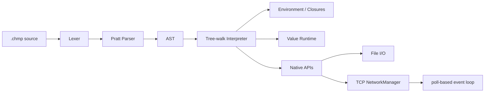

<div align="center">

# Chompo

### A dynamic language and tree-walk interpreter in C++23

[](https://en.cppreference.com/w/cpp/23)
[](https://cmake.org/)
[](https://github.com/Bony-Lord/ChompoC/actions/workflows/ci.yml)
[](LICENSE)


**Chompo** is a dynamically typed language with `.chmp` files, first-class functions, closures, mutable arrays and strings, file I/O, and a TCP API.

[Features](#-features) · [Quick Start](#-quick-start) · [I/O](#-input-and-output) · [Network API](#-network-api) · [LangJam](#-langjam-readiness) · [Roadmap](#-roadmap)

</div>

> [!IMPORTANT]
> The active development branch is `dev`. Before the LangJam submission, priority is given to a working chat, launch documentation, and a demo scenario. A custom VM or AtomVM is not required.

**Русская версия** → [README_RU.md](README_RU.md)

## ✨ Features

| Subsystem      | Status | Capabilities |
|----------------|--------|--------------|
| Values         | ✅     | `NULL`, `bool`, `integer`, `double`, `char`, `string`, `array`, `callable` |
| Variables      | ✅     | `var`, nested scopes, regular and compound assignments |
| Control Flow   | ✅     | `if`, `else`, `while`, `for-in`, `break`, `continue` |
| Functions      | ✅     | parameters, `return`, recursion, first-class functions, closures |
| Collections    | ✅     | arrays, indexing, mutation, `len`, `in`, repetition and concatenation |
| Strings        | ✅     | byte `char`, indexing and mutation |
| I/O            | ✅     | `input`, `istream`, `ostream`, `iostream` |
| TCP            | ✅     | listener, client socket, poll, accept, send, receive, close |
| Reliability    | ✅     | Runtime StackOverflow, prohibition of cyclic arrays, CTest, GitHub Actions |
| LangJam chat   | 🚧     | server and client in Chompo still need to be written |

## 🚀 Quick Start

Requires a C++23 compiler and CMake 4.2+.

```bash
cmake -S . -B build
cmake --build build --parallel
ctest --test-dir build --output-on-failure
```

**Run:**

```bash
./build/Chompo program.chmp
```

**Windows (multi-config generator):**

```powershell
.\build\Debug\Chompo.exe program.chmp
```

## ⚡ Example

```javascript
fun sum(values) {
    var result = 0;

    for (var value in values)
        result += value;

    return result;
}

var values = Array{10, 20, 30};
print(sum(values), "\n");
```

## 🧩 Core Syntax

```javascript
var value = 10;
value += 5;

if (value > 10) {
    print("large\n");
}

while (value > 0)
    value--;

for (var character in "Chompo") {
    if (character == 'm')
        continue;

    print(character);
}
```

Built-in conversions: `Int`, `Double`, `Bool`, `String`, `Char`, `Array`, `CATS`, `Type`.

## 📥 Input and Output

`input()` reads one line from the current input stream without `\n`. Returns `NULL` on EOF.

```javascript
var line = input();
```

The standard stream is denoted by the string `"standart"` — the spelling is preserved as part of the current API.

```javascript
istream("input.txt");
istream("standart");

ostream("output.txt", "rewrite");
ostream("output.txt", "append");
ostream("new.txt", "create");
ostream("standart");

iostream("input.txt", "output.txt", "rewrite");
iostream();
```

**Output file modes:**

| Mode       | Behavior |
|------------|----------|
| `"rewrite"` | create file or completely overwrite existing one (default) |
| `"append"`  | append to the end |
| `"create"`  | create new file and fail if it already exists |

## 🌐 Network API

The network API uses the host's TCP sockets. No custom VM is required.

| Function                        | Result |
|---------------------------------|--------|
| `netListen(host, port, backlog?)` | listener handle |
| `netConnect(host, port)`        | client socket handle |
| `netAccept(listener)`           | socket handle or `NULL` if no connections yet |
| `netPoll(handles, timeoutMs?)`  | array of ready handles |
| `netSend(socket, data)`         | number of bytes sent |
| `netReceive(socket, maxBytes?)` | `Array{"data", text}`, `Array{"wait"}` or `Array{"closed"}` |
| `netReceiveLine(socket)`        | same structure, but reads until `\n` |
| `netPort(handle)`               | local TCP port (convenient for testing with port `0`) |
| `netClose(handle)`              | closes listener or socket |

**Minimal echo server:**

```javascript
var listener = netListen("0.0.0.0", 4040);
var clients = Array{};

while (true) {
    var watched = Array{listener} + clients;
    var ready = netPoll(watched, 100);

    for (var handle in ready) {
        if (handle == listener) {
            var client = netAccept(listener);
            if (client != NULL)
                clients += Array{client};
            continue;
        }

        var packet = netReceiveLine(handle);

        if (packet[0] == "data")
            netSend(handle, packet[1] + "\n");
    }
}
```

> [!NOTE]
> The API is synchronous, but sockets are non-blocking. `netPoll` allows building a single-threaded event loop and serving multiple users with one interpreter.

## 🏗 Architecture



A tree-walk interpreter already satisfies the “compiler or interpreter” requirement. A bytecode VM may be added later for performance but is not part of the mandatory submission.

## 🧪 Testing

```bash
ctest --test-dir build --output-on-failure
```

The test suite includes language golden tests, error regression suite, file I/O, and TCP loopback tests. GitHub Actions builds and runs tests on Windows and Ubuntu on `push` and `pull_request`.

## 🏁 LangJam Readiness

According to the rules of `langdev-jam/plic`, a language and a multi-user chat room are required. AtomVM is listed as a priority, but alternative platforms are allowed; Chompo is already a C++ interpreter.

### Completed

- [x] Custom syntax and semantics
- [x] Interpreter on the chosen platform
- [x] Variables and dynamic types
- [x] Conditionals
- [x] Loops and recursion
- [x] Functions and closures
- [x] Arrays and strings
- [x] User and file I/O
- [x] TCP listener/client API
- [x] Non-blocking `netPoll` for multiple clients
- [x] Automatic tests for Windows/Linux

### Still Required

- [ ] Write chat server in Chompo
- [ ] Write chat client in Chompo
- [ ] User registration and unique names
- [ ] Broadcast messages to all participants
- [ ] History of last `N` messages
- [ ] Proper exit and user removal
- [ ] Short launch instructions for server and clients
- [ ] Brief syntax description in the submission directory
- [ ] Add project to fork `langdev-jam/plic` and open a pull request

### For Architecture & Creativity Points

- [ ] Commands `/help`, `/history`, `/quit`
- [ ] Timestamps
- [ ] Multiple rooms or private messages
- [ ] History persistence via `ostream(..., "append")`
- [ ] Graceful handling of disconnected clients

> [!WARNING]
> The deadline in the jam repository is **July 20**. Until then, do not spend time on VM, GC, LSP, or a full async model.

## 🗺 Roadmap

### Before LangJam

- [x] `while`, `for-in`, `break`, `continue`, `in`
- [x] Stream and file I/O
- [x] String modes `rewrite`, `append`, `create`
- [x] TCP API and `netPoll`
- [ ] Complete chat in Chompo
- [ ] Submission package and demo

### After LangJam

- [ ] `Map`/dictionaries
- [ ] Modules and `import`
- [ ] Language exceptions
- [ ] Unicode
- [ ] Garbage collector for cyclic graphs
- [ ] Bytecode compiler and VM only if real performance is needed
- [ ] Actors/channels and full async runtime
- [ ] REPL, formatter, LSP and editor plugins

## 📄 License

MIT — see [LICENSE](LICENSE).